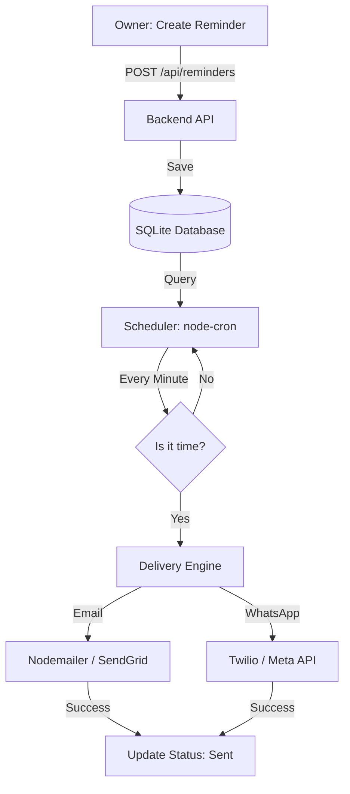

# 🧠 Reminder System Architecture

This document outlines the core logic and architectural decisions behind the Client Reminder Bot.

## 🔹 Core Philosophy: Backend-Only Delivery
**Decision:** All reminder processing and delivery must happen on the backend server.
**Why:** 
- Frontend browsers cannot run in the background or maintain 24/7 activity.
- APIs and secrets (SMTP/Twilio keys) are protected on the server.
- The system continues to run even if all users close their browsers.

---

## 🔹 System Workflow

---

## 🔹 Detailed Implementation Phases

### Phase 1: Persistence
- **Client Model**: Stores destination data (Email, Phone) and personalization fields (Name).
- **Reminder Model**: Stores content, schedule time, delivery channel, and status (`pending`, `sent`, `failed`).
- **Why**: Without persistence, the system would lose all tasks upon a restart.

### Phase 2: Intent Capture
- **Frontend Forms**: Capture the user's intent (Who, What, When, How).
- **Validation**: The backend strictly validates all incoming data to prevent security risks or invalid tasks.

### Phase 3: The Heart (The Scheduler)
- **Node-Cron**: Runs a "heartbeat" every 60 seconds.
- **Query Logic**: Searches for `scheduleAt <= currentTime AND sent = false`.
- **Reliability**: This "pull" method is more stable than "exact time" timers which can crash across restarts.

### Phase 4: Delivery Engine
- **Email Flow**:
  - Uses **SMTP** (Nodemailer for dev, SendGrid for production).
  - Handles delivery and updates the database flag to prevent duplicates.
- **WhatsApp Flow**:
  - Uses **Official APIs** (Twilio/Meta) to prevent number banning.
  - Implements **Message Templates** for production compliance.

---

## 🔹 Localhost vs. Production
| Feature | Localhost (Dev) | Production |
|---------|-----------------|------------|
| **Email** | Gmail / Log Only | SendGrid (Dedicated) |
| **WhatsApp** | Twilio Sandbox | Official Live API |
| **Persistence** | SQLite | SQLite / Postgres |
| **Safety** | Logs Errors | Retries & Monitoring |

---

## 🔹 Safety Checklist
- [x] **Database Persistence**: No data loss on restart.
- [x] **Cron Scheduling**: Reliable time-based execution.
- [x] **Backend-Only Delivery**: Secure and background-ready.
- [x] **Status Flagging**: Zero chance of duplicate messages.
- [x] **Secret Management**: Env variables protection.
